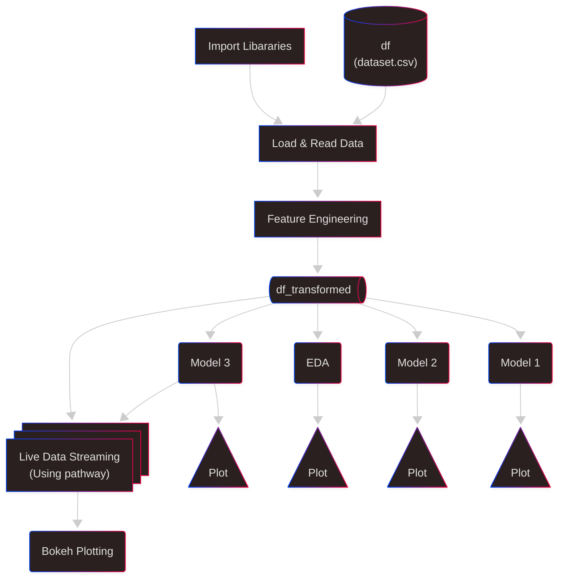

# Dynamic-Urban-Parking

This project builds a smart, data-driven parking pricing system using machine learning and real-time streaming.

---
## 🚀Check out the working 
- Streamlit application : https://dynamic-urban-parking.streamlit.app/
- Colab Notebook : [Dynamic_Urban_Parking.ipynb](https://colab.research.google.com/drive/1WQZsQeInsULlSrtqpuDj28zQ1aK5cBv1?usp=sharing)
- Report : [Dynamic_Urban_Parking_Report.pdf](https://github.com/mkj-1901/Dynamic-Urban-Parking/Dynamic_Urban_Parking_Report.pdf)
---

## 📌 Problem Statement ([↗](https://colab.research.google.com/drive/1WQZsQeInsULlSrtqpuDj28zQ1aK5cBv1?usp=sharing))

Design dynamic pricing for 14 urban parking spots based on:
- Occupancy and queue length
- Vehicle type and traffic conditions
- Time of day and special events
- Competitive nearby prices

---
## 🛠️ Tech Stack

- **Python**: Core programming language for data processing and modeling
- **Pandas, NumPy**: Data manipulation and numerical operations
- **Jupyter Notebook**: Prototyping and experimentation
- **Pathway**: Real-time data streaming and processing
- **Bokeh**: Interactive data visualization

---

## 🏗️ System Architecture



- **Data Sources**: Real-time occupancy, traffic, events, and competitor prices
- **Data Ingestion**: Streamed and processed using Pathway
- **Feature Engineering**: Transform raw data into model-ready features
- **Model Selection**: Apply and compare pricing models
- **Dynamic Pricing Engine**: Computes optimal prices per spot
- **Visualization**: Live dashboards for monitoring and insights

--- 
## 📊 Dataset Overview


### 🔧 Feature Engineering:
- Combined date & time into `TimeStamp`
- Derived `TimeCategory` (morning, noon, afternoon)
- Encoded `VehicleType`
- Calculated:
  - `Utilization = Occupancy / Capacity`
  - `QueuePressure = QueueLength / (Capacity - Occupancy)`


---

## 🧠 Models

### 🔹 Model 1: Baseline Linear Model

A simple pricing formula based on spot utilization:

```python
𝑝𝑟𝑖𝑐𝑒 = 𝑏𝑎𝑠𝑒_𝑝𝑟𝑖𝑐𝑒 + α * 𝑢𝑡𝑖𝑙𝑖𝑧𝑎𝑡𝑖𝑜𝑛
# where base_price = 10 and alpha = 5

```


### 🔹 Model 2: Demand Based Model

It uses weights on various parameters and balances it :

```python
# Demand-Based Dynamic Pricing Formula

raw_demand = (
    α * Utilization +
    β * QueueLength -
    γ * TrafficConditionNearby +
    δ * IsSpecialDay +
    ε * VehicleType
)

# Normalize raw_demand between 0 and 1 using MinMax normalization
norm_demand = (raw_demand - min_demand) / (max_demand - min_demand + 1e6)

# Final price calculation
price = base_price * (1 + λ * norm_demand)

# Parameters:
# base_price = 10
# α = 3
# β = 0.3
# γ = 0.5
# δ = 1
# ε = 0.5
# λ = 0.5

```


### 🔹 Model 3: Competetive Pricing Model (Location Aware)

This model uses a linear regression model to form a price function with adjusted weights. This takes care of competetiveness and also has a rerouting option which uses haversine function to calculate distances and reroute.

``` python
# Step 1: Compute multiplier using weighted features
multi_i = 1 + (
    0.35 * u_i + 
    0.25 * P_i + 
    0.1  * Q_norm_i + 
    0.1  * (V_i / 3) + 
    0.05 * (T_i / 2) + 
    0.1  * (C_i / 2) + 
    0.05 * S_i
)

# Step 2: Compute temporary price using multiplier
p_temp_i = p_base * multi_i

# Step 3: Prepare training data
# Feature matrix X (m rows, n features):
X = [
    [u1, P1, Q_norm1, V1, T1, S1, C1],
    [u2, P2, Q_norm2, V2, T2, S2, C2],
    ...
    [um, Pm, Q_normm, Vm, Tm, Sm, Cm]
]

# Target output vector y (temporary prices):
y = [
    p_temp1,
    p_temp2,
    ...
    p_tempm
]

# Step 4: Add bias term (X_bias) and compute weights using normal equation
# Add a leading 1 to each feature row for bias:
X_bias = [
    [1, u1, P1, Q_norm1, V1, T1, S1, C1],
    [1, u2, P2, Q_norm2, V2, T2, S2, C2],
    ...
    [1, um, Pm, Q_normm, Vm, Tm, Sm, Cm]
]

# Compute weights:
w = (X_bias.T @ X_bias)^(-1) @ X_bias.T @ y

# Step 5: Predict final prices using learned weights
p_hat = X_bias @ w

```


## Live Data Streaming using `pathway` and `Bokeh` plotting


